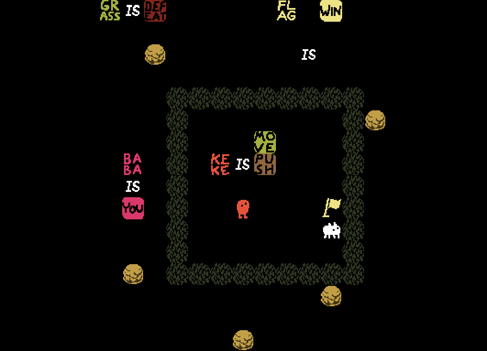

# Baba Is you

*Par Anthony Fernandes et Gabriel Choucroun, binôme n°89*



Le sujet du projet est le fichier [sujet.pdf](sujet.pdf) et le rapport se trouve
dans le fichier [rapport/rapport.pdf](rapport/rapport.pdf).

## Compilation et execution

```bash
# Compilation + exécution
make
./main

# Nettoyage
make clean

# Raccourci pour les 3 commandes précédentes
make run
```

## Contrôles

| Touche                                                 | Effet                                              |
|--------------------------------------------------------|----------------------------------------------------|
| <kbd>↑</kbd>, <kbd>↓</kbd>, <kbd>←</kbd>, <kbd>→</kbd> | Déplacements                                       |
| <kbd>Entrée</kbd>                                      | Dans le menu : sélectionner le niveau              |
| <kbd>Q</kbd>                                           | Dans le menu : quitter<br/>En jeu : retour au menu |
| <kbd>R</kbd>                                           | En jeu : Réinitialiser le niveau                   |
| <kbd>Z</kbd>, <kbd>Y</kbd>                             | En jeu : Annuler, rétablir                         |
